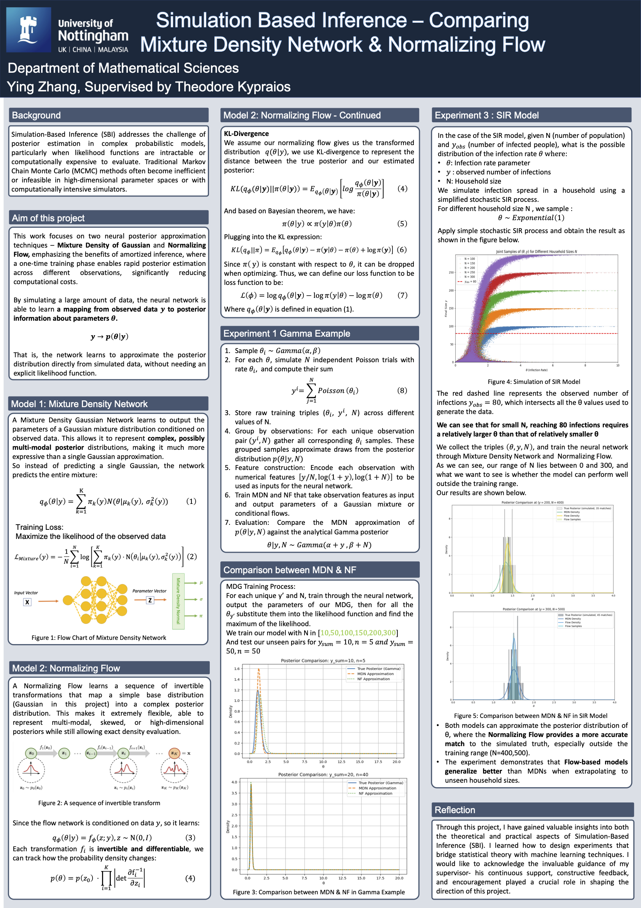

# SBI

This is a repository to document the work done under the general umbrella of Sample Based Inference (SBI) including  Neural Posterior Estimation (NPE), amortised inference which will be undertaken during the 2025 summer research internship research programme. 

## Things to do

- [X] Theo to ask Ying (smyyz22@exmail.nottingham.ac.uk) and Danny (pmydg7@exmail.nottingham.ac.uk) to create Github accounts if they have not one already.
- [X] Theo to give Danny and Ying access to this repository
- [X] Theo to prepare a document to share with Danny and Ying to outline the idea behind this project.
- [X] Create a directory to include some relevant papers

## Week 01 9th June

- Initial meeting took place on Monday the 9th of June. Went over the idea behind SBI via a simple example of Binomial distribution (N, $\theta$) and suggested to approximate the posterior distribution of $\theta$ given data $y$ using a Normal distribution with the mean and the variance depending on $y$. This will involve exploration of the relationship between the sample mean and sample variance of $\theta$ and $y$ to see if there a way to fit some sort of regression model. 

## Week 02 17th June

- Danny and Ying finish the DNN part on Beta example, we try to fix the data y with seed(123)
- Set the mean in the structure as 3 hidden layers (We've tested that for this ideal toy example, structure doesn't matter)
- Set the variance as quadratic form so our DNN learn in such structure
- Set our pdf and loss function to be that Theo mentioned on 2025-06-16

## Week 02 18th 19th June

- Danny and Ying use the mu_pred and var_pred from the model in the loss function.
- Ying just finish Chapter 5, and preparing to try Gamma example and multi-Gaussian on our Beta example

## Week 02 20th June

- Danny and Ying finish the mixture of Gaussian on Beta example, it exhibits good fit compared with only one Gaussian
- Danny and Ying finish the DNN on Gamma distribution, it fits well.
