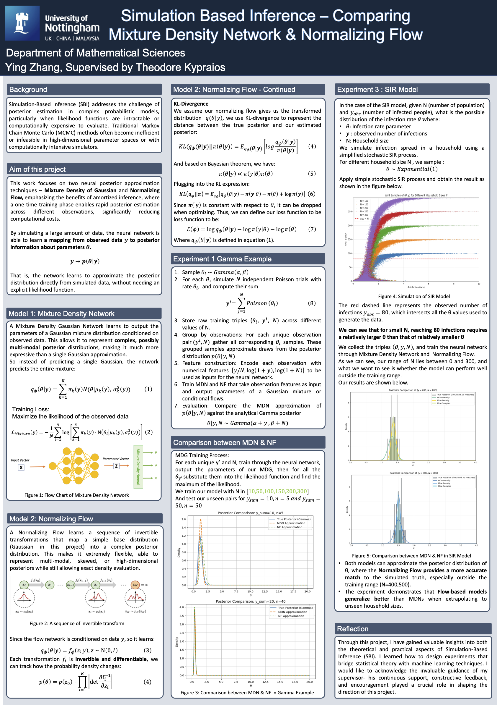

# Simulation-Based Inference (SBI) — Summer Research Project



> Summer 2025 research internship at the University of Nottingham, supervised by Theo Sherard-Smith.
> Contributors: **Ying Zhang**, **Danny**

## Overview

This project explores **Simulation-Based Inference (SBI)** — learning to approximate posterior distributions using neural networks, without requiring an analytical likelihood. We progressively build from simple toy examples to normalising flows:

1. **Binomial-Beta model**: approximate the posterior of θ given binomial observations
2. **Gamma-Poisson model**: extend to continuous-valued sufficient statistics
3. **Mixture of Gaussians (MoG)**: more flexible posterior approximations
4. **Amortised inference**: train once, query for any observed data
5. **Normalising flows**: transform simple distributions into complex posteriors

## Repository Structure

```
.
├── 00-preliminaries/           # Background material & R code
│   ├── preliminaries.qmd       # Quarto document: math foundations
│   ├── normalising-flow-minimal-example-likelihood-known.R
│   ├── simSIR-Markov.R         # SIR epidemic simulation
│   └── SIR-final-size.R
│
├── 01-sbi-in-r/                # Phase 1: SBI basics in R
│   ├── Beta_Example.Rmd        # Beta-Binomial conjugate example
│   └── Gamma_report.html       # Gamma posterior report
│
├── 02-normal-approximation/    # Phase 2: NN-based Normal approximations
│   ├── 1_Normal Approximation (MSE parameters) to Beta posterior.py
│   ├── 2_Normal Approximation (Log-Likelihood) to Beta Posterior.py
│   ├── 3_Improved Normal Approximation (Log-Likelihood) to Beta Posterior.py
│   ├── 4_Beta Approximation (Log-Likelihood) to Beta Posterior.py
│   ├── 5_Normal Approximation (MSE parameters) to Gamma posterior.py
│   ├── 6_Normal Approximation (Log-Likelihood) to Gamma Posterior.py
│   └── Binomial with multiple.ipynb
│
├── 03-gaussian-mixture/        # Phase 3: Mixture of Gaussians approximations
│   ├── modles.py               # Shared model definitions (ProbabilisticNN, MixtureDensityNN)
│   ├── Gaussian Mixture Approximation of Beta Posterior.py
│   ├── Guassian Mixture Approximation of Gamma Posterior.py
│   ├── Comparing MOG and Single Gaussian Approximations of a Beta Posterior.py
│   ├── Gaussian Mixture Inference Network and MCMC for Gamma Posterior.ipynb
│   └── Report2.ipynb
│
├── 04-amortised-inference/     # Phase 4: Amortised inference
│   ├── Amortized Inference for Binomial small N.ipynb
│   ├── Amortized Inference for Binomial with large N.ipynb
│   ├── Amortized Inference for SIR models.ipynb
│   ├── SIR with large n.ipynb
│   ├── Deepnetwork.py / Shallow.py / Refined.py   # NN architectures
│   ├── Normalising_Flow_EX.py
│   └── report_Week 3.ipynb
│
├── 05-normalising-flows/       # Phase 5: Normalising flow methods
│   ├── Normalising Flow From Normal to Beta.ipynb
│   ├── Normalising Flow From Normal to Gamma.ipynb
│   ├── 1D autogression Normal beta_*.py   # Autoregressive flow variants
│   ├── ELBO for iid Gamma data.py
│   ├── *Binomial - with KL Loss.py        # KL-based training
│   └── Samples from Normal - with KL Loss.py
│
├── 06-sufficient-statistics/   # Phase 6: Sufficient statistics & flexible n
│   ├── Beta_flexible_n.py
│   ├── Gamma_fixed_n*.py / Gamma_Example*.py
│   ├── MOG_flexible_Gamma.py
│   └── *.ipynb                 # Corresponding notebooks with results
│
├── 07-real-nvp/                # Phase 7: Real NVP architecture
│   └── NVP.ipynb
│
├── reports/                    # Compiled reports
│   ├── notebooks/              # Jupyter notebook versions
│   └── html-pdf/               # Rendered HTML & PDF versions
│
├── literature/                 # Key reference papers
│   ├── greenberg19a.pdf        # Automatic Posterior Transformation
│   ├── papamakarios19a.pdf     # Sequential Neural Likelihood
│   └── lueckmann19a.pdf        # Flexible Statistical Inference
│
├── drafts/                     # Poster drafts
│
└── archive/                    # Original unorganised files (kept for reference)
```

## Progression Guide (Recommended Reading Order)

| Phase | Folder | What you'll learn |
|-------|--------|-------------------|
| 0 | `00-preliminaries/` | Mathematical foundations, R basics |
| 1 | `01-sbi-in-r/` | Conjugate Bayesian inference in R |
| 2 | `02-normal-approximation/` | Using DNNs to learn μ and σ² of a Gaussian approximation |
| 3 | `03-gaussian-mixture/` | Mixture Density Networks for flexible posteriors |
| 4 | `04-amortised-inference/` | Train once, infer for any observation — applied to Binomial & SIR |
| 5 | `05-normalising-flows/` | Invertible transforms: Normal → Beta/Gamma via normalising flows |
| 6 | `06-sufficient-statistics/` | Handling variable sample sizes with sufficient statistics |
| 7 | `07-real-nvp/` | Real NVP architecture for higher-dimensional flows |

## Key Concepts

- **Neural Posterior Estimation (NPE)**: Train a neural network to map observations → posterior parameters
- **Amortised Inference**: A single trained network can produce posteriors for *any* observed data, not just one fixed observation
- **Mixture Density Networks**: Output parameters of a Gaussian mixture → more flexible than a single Gaussian
- **Normalising Flows**: Chain of invertible transforms that warp a simple base distribution into a complex posterior

## Weekly Progress Log

### Week 1 (9 Jun 2025)
- Kicked off with Binomial(N, θ) toy example
- Explored regression-based posterior approximation

### Week 2 (17–20 Jun 2025)
- Built DNN for Beta posterior (single Gaussian output)
- Extended to Mixture of Gaussians — significantly better fit
- Completed Gamma-Poisson example

### Week 3+
- Amortised inference for Binomial and SIR models
- Normalising flow experiments (autoregressive, KL-based)
- Sufficient statistics for flexible sample sizes
- Real NVP architecture

## Literature

| Paper | Topic |
|-------|-------|
| Greenberg et al. (2019) | Automatic Posterior Transformation for Likelihood-Free Inference |
| Papamakarios et al. (2019) | Sequential Neural Likelihood |
| Lueckmann et al. (2019) | Flexible Statistical Inference for Mechanistic Models |

See also: [Understanding Deep Learning](https://udlbook.github.io/udlbook/) (Chapters 1–5)

## Setup

```bash
pip install torch numpy scipy matplotlib
```

For R-based examples: install R with packages `ggplot2`, `dplyr`.
